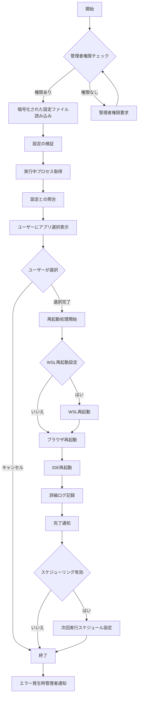
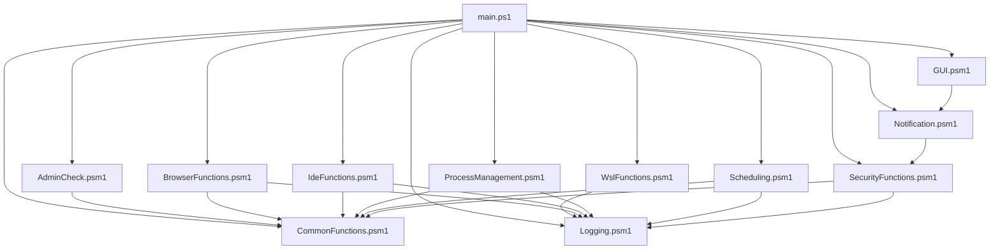
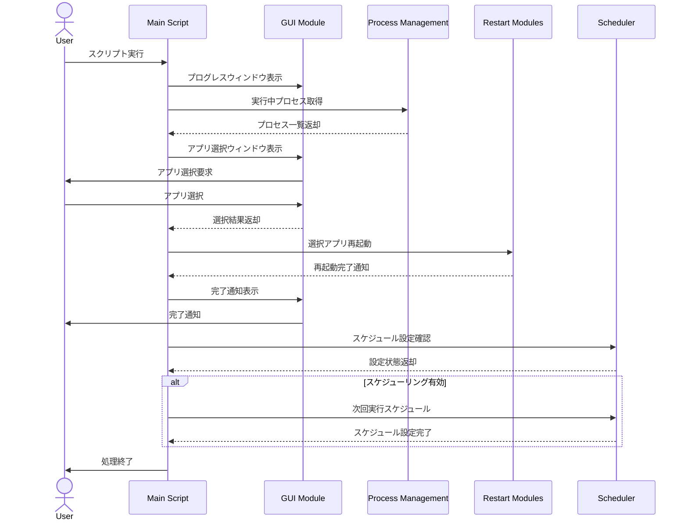
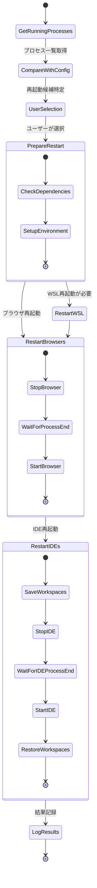
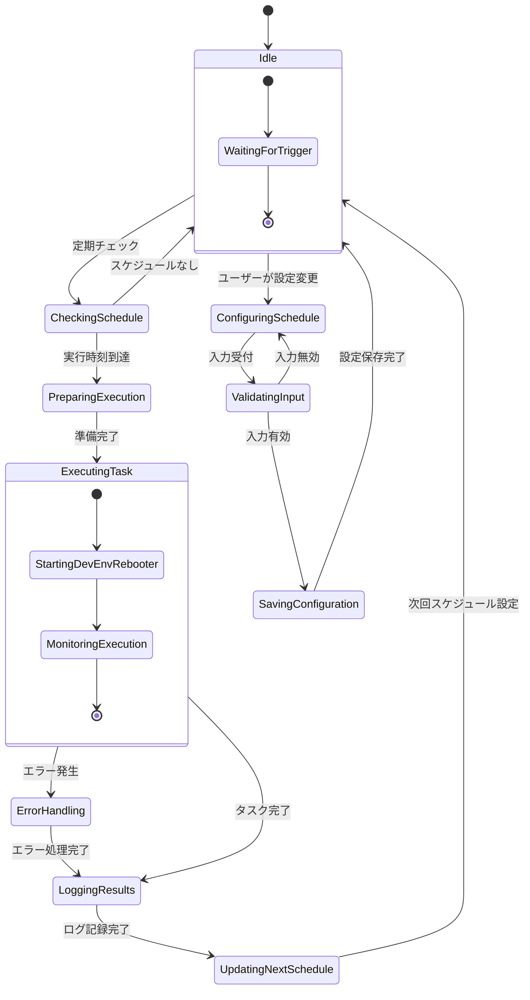
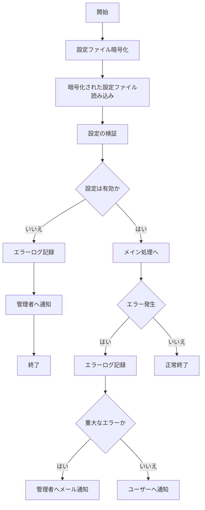

プロジェクト概要:
DevEnvRebooterは、開発者向けの高度な環境管理ツールです。このPowerShellベースのアプリケーションは、WSL（Windows Subsystem for Linux）、各種ブラウザ、そして複数のIDEを効率的に再起動することを目的としています。

主要機能:

1. 並列処理:
   - ThreadJobモジュールを使用して、複数のアプリケーションを同時に再起動します。
   - 処理時間を大幅に短縮し、特に多数のアプリケーションを再起動する際に効果的です。

2. 設定管理:
   - JSON形式の設定ファイル（config.json）を使用して、再起動対象のアプリケーションパスやログ設定などをカスタマイズ可能です。
   - 設定ファイルの検証機能により、無効な設定や欠落した必須項目を検出します。

3. グラフィカルユーザーインターフェース（GUI）:
   - Windows Forms を使用して、進行状況を視覚的に表示するプログレスウィンドウを実装しています。
   - リアルタイムで更新される進行状況バーと状態ラベルにより、ユーザーは処理の進行を容易に把握できます。
   - ユーザーが再起動するアプリケーションを選択できるウィンドウを実装しました。
   - チェックボックスリストを使用して、直感的な操作が可能です。

4. 高度なログ機能:
   - 4段階のログレベル（DEBUG, INFO, WARNING, ERROR）を実装し、詳細な動作記録を可能にしています。
   - JSON形式でログを記録し、後の分析や処理を容易にしています。
   - ログローテーション機能により、ログファイルのサイズ管理と履歴保持を自動化しています。

5. エラーハンドリングと通知:
   - 包括的な例外処理により、予期せぬエラーを適切にキャッチし、ログに記録します。
   - エラー発生時には、GUIを通じてユーザーに分かりやすく通知します。

6. セキュリティ強化:
   - 管理者権限の確認と要求を自動化し、必要な権限なしでの実行を防止します。
   - ユーザー入力のサニタイズ機能により、潜在的な悪意のある入力を防御します。

7. テスト機能:
   - Pesterフレームワークを使用した包括的な単体テストと統合テストを実装しています。
   - モックアプリケーションを用いた高度な統合テストにより、実環境に近い状況でのテストが可能です。

8. モジュール化された設計:
   - 機能ごとに分離されたモジュール構造により、コードの保守性と拡張性を高めています。
   - 各モジュールは特定の機能（WSL管理、ブラウザ管理、IDE管理など）に特化しています。

9. 動的プロセス検出と管理:
   - 実行中のアプリケーションを動的に検出し、config.jsonの設定と照合します。
   - 実際に実行中のアプリケーションのみを再起動するため、不要な処理を削減します。

10. 詳細なプロセス情報の取得と表示:
    - 各アプリケーションの詳細な情報（CPU使用率、メモリ使用量、起動時間など）を取得します。
    - 情報を見やすく表示するウィンドウを実装しました。

11. 定期的な自動スキャンと再起動のスケジューリング機能:
    - Windows のタスクスケジューラを利用して、定期的な実行をスケジュールする機能を追加しました。
    - 日次、週次、または特定の時間での実行が可能です。

ディレクトリ構造:

```
DevEnvRebooter/
│
├── main.ps1                # メインスクリプト
├── config.json             # 設定ファイル
│
├── modules/                # 機能別モジュール
│   ├── AdminCheck.psm1     # 管理者権限チェック
│   ├── WslFunctions.psm1   # WSL関連機能
│   ├── BrowserFunctions.psm1 # ブラウザ関連機能
│   ├── IdeFunctions.psm1   # IDE関連機能
│   ├── Logging.psm1        # ログ機能
│   ├── GUI.psm1            # GUI関連機能
│   ├── Notification.psm1   # 通知機能
│   ├── CommonFunctions.psm1 # 共通ユーティリティ関数
│   ├── ProcessManagement.psm1 # プロセス管理機能
│   └── Scheduling.psm1     # スケジューリング機能
│
├── Tests/                  # テストディレクトリ
│   ├── UnitTests.ps1       # 単体テスト
│   └── IntegrationTests.ps1 # 統合テスト
│
├── logs/                   # ログ出力ディレクトリ
│   └── restart_log.txt     # ログファイル
│
├── docs/                   # ドキュメント
│   ├── UserGuide.md        # ユーザーガイド
│   └── DeveloperGuide.md   # 開発者ガイド
│
├── images/                 # 画像リソース
│   ├── icon.png            # アプリケーションアイコン
│   └── screenshot.png      # スクリーンショット
│
├── .gitignore              # Gitの無視ファイル設定
├── README.md               # プロジェクト概要
└── LICENSE                 # ライセンス情報
```

主要なファイルの内容:

1. main.ps1:
   - アプリケーションのエントリーポイント
   - 各モジュールの読み込みと初期化
   - メインのロジック実行（設定読み込み、プロセス検出、ユーザー選択、再起動処理、ログ記録）
   - エラーハンドリングとGUI更新

2. config.json:
   - アプリケーションの設定を格納
   - 再起動対象のアプリケーションパス
   - ログ設定
   - WSL再起動の有無
   - スケジューリング設定

3. modules/AdminCheck.psm1:
   - 管理者権限のチェックと要求機能

4. modules/WslFunctions.psm1:
   - WSLの再起動処理

5. modules/BrowserFunctions.psm1:
   - ブラウザの再起動処理

6. modules/IdeFunctions.psm1:
   - IDEの再起動処理

7. modules/Logging.psm1:
   - ログ記録機能
   - ログローテーション機能

8. modules/GUI.psm1:
   - プログレスウィンドウの表示
   - アプリケーション選択ウィンドウの表示

9. modules/Notification.psm1:
   - ユーザーへの通知機能

10. modules/CommonFunctions.psm1:
    - 共通のユーティリティ関数
    - 入力サニタイズ機能

11. modules/ProcessManagement.psm1:
    - 実行中プロセスの検出
    - 設定との照合
    - 詳細なプロセス情報の取得と表示

12. modules/Scheduling.psm1:
    - タスクスケジューラとの連携
    - 定期実行の設定と管理

13. Tests/UnitTests.ps1:
    - 各モジュールの単体テスト

14. Tests/IntegrationTests.ps1:
    - アプリケーション全体の統合テスト

この構造により、DevEnvRebooterは高度にモジュール化され、拡張性と保守性の高いアプリケーションとなっています。ユーザーは柔軟に環境を管理でき、開発者は容易に新機能を追加したりバグを修正したりすることができます。

現在のバージョンでは、基本的な再起動機能に加えて、動的プロセス検出、詳細情報表示、スケジューリング機能など、高度な機能が実装されています。今後は、多言語サポート、リモート管理機能、パフォーマンス最適化、詳細な統計情報とレポート機能などの追加が検討されています。


## システムの動作

DevEnvRebooterの処理フロー図を作成することで、システムの動作をより深く理解することができます。：

1. メインプロセスのフローチャート
2. モジュール間の依存関係図
3. ユーザー操作のシーケンス図
4. プロセス検出と再起動のアクティビティ図
5. スケジューリング機能のステート図

これらの図から、システムの全体像や各部分の詳細な動作を視覚的に理解できます。
では、最初にメインプロセスのフローチャートを作成してみましょう。


### メインプロセスのフローチャート


この図は、DevEnvRebooterのメインプロセスを視覚的に表現しています。主要なステップとして、管理者権限のチェック、設定ファイルの読み込み、プロセスの検出と照合、ユーザーによるアプリケーション選択、再起動処理、ログ記録、そしてスケジューリングが含まれています。

### モジュール間の依存関係図




この図は、main.ps1を中心として各モジュールがどのように関連しているかを示しています。矢印は依存関係の方向を表しており、例えばWslFunctions.psm1がLogging.psm1に依存していることがわかります。

### ユーザー操作のシーケンス図




この図は、ユーザーがDevEnvRebooterを実行してから処理が完了するまでの一連の流れを示しています。ユーザーとシステムの各コンポーネント（メインスクリプト、GUIモジュール、プロセス管理モジュール、再起動モジュール、スケジューラ）間のやり取りが時系列で表現されています。


### プロセス検出と再起動のアクティビティ図から始めます。




この図は、プロセス検出から再起動までの詳細な流れを示しています。主要なステップには、実行中プロセスの取得、設定との比較、ユーザー選択、再起動準備、各種アプリケーション（WSL、ブラウザ、IDE）の再起動、そして結果のログ記録が含まれています。また、ブラウザとIDEの再起動プロセスの詳細も示されています。

### スケジューリング機能のステート図




この図は、スケジューリングシステムの異なる状態と、それらの間の遷移を示しています。主要な状態には、アイドル状態、スケジュールチェック、実行準備、タスク実行、結果のログ記録、次回スケジュールの更新などが含まれています。また、ユーザーによるスケジュール設定の変更プロセスやエラーハンドリングの流れも示されています。

### セキュリティ機能のフロー図



セキュリティ機能のフロー図では、暗号化、検証、エラー通知のプロセスを視覚化しています。


これらの図を合わせて使用することで、DevEnvRebooterの動作をさまざまな側面から詳細に理解することができます：

1. メインプロセスのフローチャートは全体の流れを示します。
2. モジュール依存関係図はシステムの構造を示します。
3. ユーザー操作のシーケンス図は時系列での相互作用を示します。
4. プロセス検出と再起動のアクティビティ図は、核となる機能の詳細な動作を示します。
5. スケジューリング機能のステート図は、自動化部分の状態と遷移を示します。

これらの図は、開発者間でのコミュニケーション、新しい開発者のオンボーディング、ドキュメンテーション、そして将来の機能拡張や最適化の計画に非常に有用です。必要に応じて、これらの図を更新したり、さらに詳細な部分に焦点を当てた図を追加したりすることで、システムの理解をさらに深めることができます。