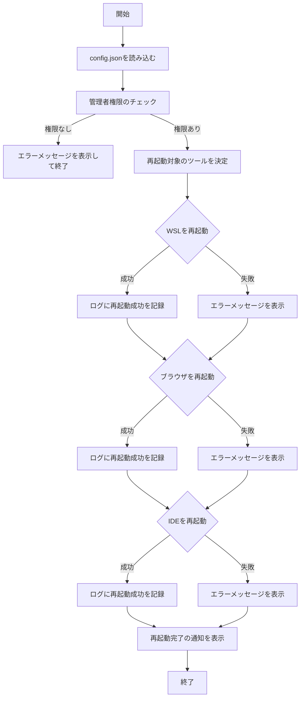

## DevEnvRebooter プロジェクトのディレクトリ構造とコード

### ディレクトリ構造
```
DevEnvRebooter/
│
├── main.ps1
├── config.json
│
├── modules/
│   ├── AdminCheck.psm1
│   ├── WslFunctions.psm1
│   ├── BrowserFunctions.psm1
│   ├── IdeFunctions.psm1
│   ├── Logging.psm1
│   └── Notification.psm1
│
└── images/
    ├── main_screen.png
    ├── progress_bar.png
    ├── error_message.png
    └── processing_flow.png
```

### 各ファイルの説明

- **main.ps1**: スクリプトのエントリーポイント。各モジュールを呼び出し、再起動処理を行う。
- **config.json**: 設定ファイル。再起動対象のアプリケーションやログ設定を管理。
- **modules/AdminCheck.psm1**: 管理者権限のチェックを行うモジュール。
- **modules/WslFunctions.psm1**: WSLの再起動機能を提供するモジュール。
- **modules/BrowserFunctions.psm1**: ブラウザの再起動機能を提供するモジュール。
- **modules/IdeFunctions.psm1**: IDEの再起動機能を提供するモジュール。
- **modules/Logging.psm1**: ログ出力とログローテーション機能を提供するモジュール。
- **modules/Notification.psm1**: ユーザー通知機能を提供するモジュール。
- **images/**: ドキュメント用のスクリーンショットや図を保存するディレクトリ。

### main.ps1
```powershell
Import-Module "$PSScriptRoot\modules\AdminCheck.psm1"
Import-Module "$PSScriptRoot\modules\WslFunctions.psm1"
Import-Module "$PSScriptRoot\modules\BrowserFunctions.psm1"
Import-Module "$PSScriptRoot\modules\IdeFunctions.psm1"
Import-Module "$PSScriptRoot\modules\Logging.psm1"
Import-Module "$PSScriptRoot\modules\Notification.psm1"

# 設定ファイルの読み込み
$configPath = "$PSScriptRoot\config.json"
$config = Get-Content $configPath | ConvertFrom-Json

# 管理者権限のチェック
if (-not (Test-AdminPrivileges)) {
    Show-ErrorNotification "このスクリプトは管理者権限で実行する必要があります。" "管理者権限が必要です"
    Exit 1
}

# WSLの再起動
if ($config.RESTART_WSL) {
    try {
        Restart-WSL
        Log-Info "WSLの再起動に成功しました。"
    } catch {
        Log-Error "WSLの再起動に失敗しました。" $_.Exception.Message
    }
}

# ブラウザの再起動
foreach ($browser in $config.BROWSERS) {
    try {
        Restart-Browser -Path $browser
        Log-Info "$browser の再起動に成功しました。"
    } catch {
        Log-Error "$browser の再起動に失敗しました。" $_.Exception.Message
    }
}

# IDEの再起動
foreach ($ide in $config.IDES) {
    try {
        Restart-IDE -Path $ide
        Log-Info "$ide の再起動に成功しました。"
    } catch {
        Log-Error "$ide の再起動に失敗しました。" $_.Exception.Message
    }
}

Show-Notification "再起動が完了しました。" "再起動完了"
```

### config.json
```json
{
    "RESTART_WAIT_TIME": 2,
    "BRAVE_PATH": "C:\\Program Files\\BraveSoftware\\Brave-Browser\\Application\\brave.exe",
    "CURSOR_PATH": "C:\\Users\\${USERNAME}\\AppData\\Local\\Programs\\cursor\\Cursor.exe",
    "LOG_FILE": "restart_log.txt",
    "HISTORY_FILE": "restart_history.log",
    "MAX_RETRIES": 3,
    "RETRY_WAIT_TIME": 5,
    "BROWSERS": ["C:\\Program Files (x86)\\Google\\Chrome\\Application\\chrome.exe", "C:\\Program Files (x86)\\Microsoft\\Edge\\Application\\msedge.exe"],
    "IDES": ["C:\\Users\\${USERNAME}\\AppData\\Local\\Programs\\cursor\\Cursor.exe", "C:\\Users\\${USERNAME}\\AppData\\Local\\Programs\\Microsoft VS Code\\Code.exe"],
    "LOG_MAX_SIZE_KB": 1024,
    "LOG_MAX_BACKUPS": 5,
    "LOG_LEVEL": "Info"
}
```

### modules/AdminCheck.psm1
```powershell
function Test-AdminPrivileges {
    $currentPrincipal = New-Object Security.Principal.WindowsPrincipal([Security.Principal.WindowsIdentity]::GetCurrent())
    return $currentPrincipal.IsInRole([Security.Principal.WindowsBuiltInRole]::Administrator)
}
```

### modules/WslFunctions.psm1
```powershell
function Restart-WSL {
    Stop-Process -Name "wsl" -Force -ErrorAction Stop
    Start-Sleep -Seconds $config.RESTART_WAIT_TIME
    wsl
}
```

### modules/BrowserFunctions.psm1
```powershell
function Restart-Browser {
    param (
        [string]$Path
    )
    Stop-Process -Name (Split-Path $Path -Leaf) -Force -ErrorAction Stop
    Start-Sleep -Seconds $config.RESTART_WAIT_TIME
    Start-Process -FilePath $Path
}
```

### modules/IdeFunctions.psm1
```powershell
function Restart-IDE {
    param (
        [string]$Path
    )
    Stop-Process -Name (Split-Path $Path -Leaf) -Force -ErrorAction Stop
    Start-Sleep -Seconds $config.RESTART_WAIT_TIME
    Start-Process -FilePath $Path
}
```

### modules/Logging.psm1
```powershell
function Rotate-LogFile {
    param (
        [string]$logFile,
        [int]$maxSizeKB = 1024,
        [int]$maxBackups = 5
    )
    
    if ((Get-Item $logFile).Length / 1KB -gt $maxSizeKB) {
        for ($i = $maxBackups; $i -gt 0; $i--) {
            $oldFile = "$logFile.$i"
            $newFile = "$logFile.$($i+1)"
            if (Test-Path $oldFile) {
                Move-Item $oldFile $newFile -Force
            }
        }
        Move-Item $logFile "$logFile.1" -Force
        New-Item $logFile -ItemType File | Out-Null
    }
}

function Log-Info {
    param ([string]$message)
    
    $logFile = "$PSScriptRoot\$($config.LOG_FILE)"
    Rotate-LogFile -logFile $logFile
    
    $logMessage = "$(Get-Date) INFO: $message"
    Write-Host -ForegroundColor Green $logMessage
    Add-Content -Path $logFile -Value $logMessage
}

function Log-Error {
    param (
        [string]$technicalMessage,
        [string]$userMessage
    )
    
    $logFile = "$PSScriptRoot\$($config.LOG_FILE)"
    Rotate-LogFile -logFile $logFile
    
    $logMessage = "$(Get-Date) ERROR: $technicalMessage"
    Write-Host -ForegroundColor Red $logMessage
    Add-Content -Path $logFile -Value $logMessage
    
    Show-ErrorNotification $userMessage "エラー発生"
}
```

### modules/Notification.psm1
```powershell
function Show-Notification {
    param (
        [string]$message,
        [string]$title = "通知"
    )
    
    if ($Host.UI.SupportsVirtualTerminal) {
        Write-Host $message -ForegroundColor Green
    } else {
        Add-Type -AssemblyName PresentationFramework
        [System.Windows.MessageBox]::Show($message, $title, [System.Windows.MessageBoxButton]::OK, [System.Windows.MessageBoxImage]::Information) | Out-Null
    }
}

function Show-ErrorNotification {
    param (
        [string]$message,
        [string]$title = "エラー"
    )
    
    if ($Host.UI.SupportsVirtualTerminal) {
        Write-Host $message -ForegroundColor Red
    } else {
        Add-Type -AssemblyName PresentationFramework
        [System.Windows.MessageBox]::Show($message, $title, [System.Windows.MessageBoxButton]::OK, [System.Windows.MessageBoxImage]::Error) | Out-Null
    }
}
```

## 処理フロー図（Mermaid）



これで、DevEnvRebooterの全体的なコードとディレクトリ構造が完了しました。この情報を元に、アプリケーションの使用方法や設定方法が簡単に理解できるようになります。