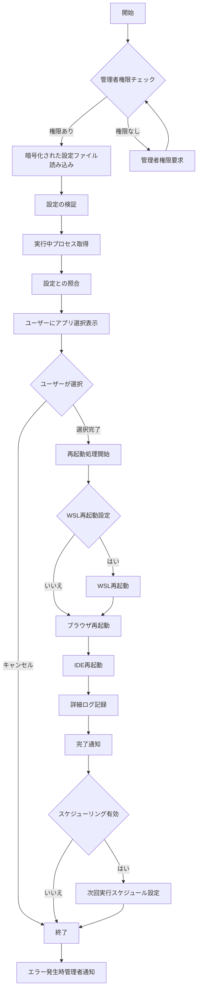
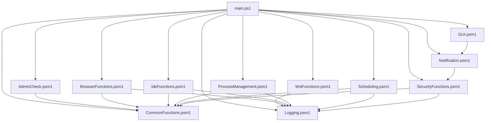
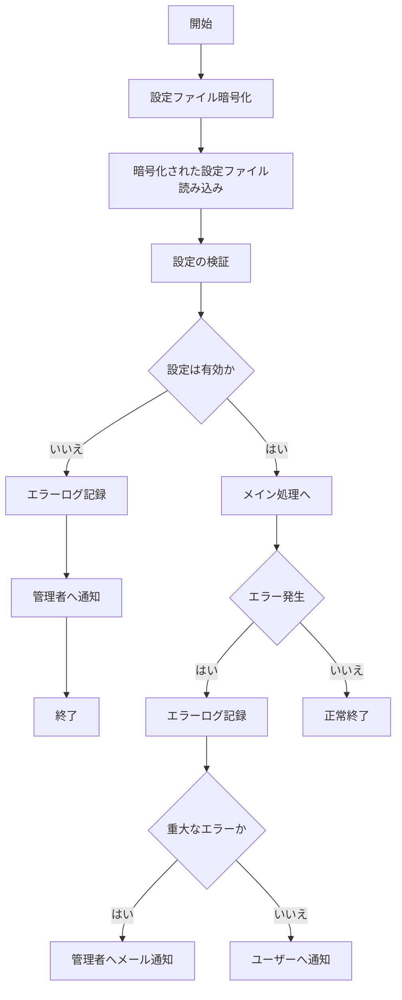

# DevEnvRebooter

## 概要
DevEnvRebooterは、開発環境（WSL、IDE、ブラウザ）の効率的な再起動を行うPowerShellベースのツールです。並列処理、GUIによる進行状況表示と通知、エラーハンドリングとログ記録、ログファイルのローテーション機能を備えています。さらに、高度なセキュリティ機能と詳細なエラー報告機能が追加されました。

## 主な機能
- WSL、ブラウザ、IDEの並列再起動
- 暗号化された設定ファイルによるセキュアなカスタマイズ
- GUIによる進行状況表示
- 詳細なログ記録とログローテーション
- 包括的なエラーハンドリングと管理者への自動通知機能
- 動的プロセス検出と選択的再起動
- スケジューリング機能

## システム要件
- Windows 10以降
- PowerShell 5.1以降
- 管理者権限

## ディレクトリ構造
```bash
DevEnvRebooter/
│
├── main.ps1                # メインスクリプト
├── config.secure           # 暗号化された設定ファイル（新規追加）
│
├── modules/                # 機能別モジュール
│   ├── AdminCheck.psm1     # 管理者権限チェック（更新）
│   ├── WslFunctions.psm1   # WSL関連機能
│   ├── BrowserFunctions.psm1 # ブラウザ関連機能
│   ├── IdeFunctions.psm1   # IDE関連機能
│   ├── Logging.psm1        # ログ機能
│   ├── GUI.psm1            # GUI関連機能
│   ├── Notification.psm1   # 通知機能
│   ├── CommonFunctions.psm1 # 共通ユーティリティ関数
│   ├── ProcessManagement.psm1 # プロセス管理機能
│   ├── Scheduling.psm1     # スケジューリング機能
│   └── SecurityFunctions.psm1 # セキュリティ関連機能（新規追加）
│
├── Tests/                  # テストディレクトリ
│   ├── UnitTests.ps1       # 単体テスト（更新）
│   └── IntegrationTests.ps1 # 統合テスト（更新）
│
├── logs/                   # ログ出力ディレクトリ
│   └── restart_log.txt     # ログファイル
│
├── docs/                   # ドキュメント
│   ├── UserGuide.md        # ユーザーガイド（更新）
│   └── DeveloperGuide.md   # 開発者ガイド（更新）
│
├── images/                 # 画像リソース
│   ├── icon.png            # アプリケーションアイコン
│   ├── screenshot.png      # スクリーンショット
│   └── architecture.png    # アーキテクチャ図（更新）
│
├── .gitignore              # Gitの無視ファイル設定（更新）
├── README.md               # プロジェクト概要（更新）
└── LICENSE                 # ライセンス情報
```

## 

### a. メインプロセスのフローチャート


### b. モジュール間の依存関係図



###c. セキュリティ機能のフロー図



## インストール手順
1. このリポジトリをクローンまたはダウンロードします。
2. 必要なPowerShellモジュールをインストールします：
   ```powershell
   Install-Module -Name Pester -Scope CurrentUser -Force
   ```
3. `config.json`ファイルを編集して、再起動するアプリケーションのパスや設定をカスタマイズします。
4. 設定ファイルを暗号化します：
   ```powershell
   Import-Module .\modules\SecurityFunctions.psm1
   Protect-ConfigFile -InputFile "config.json" -OutputFile "config.secure"
   ```
5. 元の`config.json`ファイルを安全に削除します。

## 使用方法
1. PowerShellを管理者として実行します。
2. 以下のコマンドを実行します：
   ```powershell
   .\main.ps1
   ```

## 設定ファイルの例
`config.json`ファイルの例は以下の通りです（実際の使用時は、このファイルを暗号化して`config.secure`として保存してください）：

```json
{
    "RESTART_WAIT_TIME": 2,
    "LOG_DIR": "C:\\Logs\\DevEnvRebooter",
    "LOG_FILE": "restart_log.txt",
    "RESTART_WSL": true,
    "BROWSERS": [
        "C:\\Program Files\\Google\\Chrome\\Application\\chrome.exe",
        "C:\\Program Files (x86)\\Microsoft\\Edge\\Application\\msedge.exe"
    ],
    "IDES": [
        "C:\\Users\\Username\\AppData\\Local\\Programs\\Microsoft VS Code\\Code.exe"
    ],
    "ENABLE_SCHEDULING": true,
    "SCHEDULE_TRIGGER": "Daily 09:00",
    "ADMIN_EMAIL": "admin@example.com",
    "SMTP_SERVER": "smtp.example.com",
    "SMTP_PORT": 587,
    "SMTP_USERNAME": "notifications@example.com",
    "SMTP_PASSWORD": "EncryptedPassword"
}
```

注意: SMTP_PASSWORDは、セキュリティのため暗号化して保存してください。

## トラブルシューティング
- **エラー: 管理者権限が必要です**
  - PowerShellを管理者として実行してください。
- **エラー: 設定ファイルが無効です**
  - `config.secure`ファイルが存在し、正しく暗号化されているか確認してください。
- **エラー: アプリケーションの再起動に失敗しました**
  - ログファイルを確認し、具体的なエラーメッセージを確認してください。
  - アプリケーションのパスが正しいか確認してください。

## 開発者向け情報
- テストの実行：
  ```powershell
  Invoke-Pester .\Tests\UnitTests.ps1
  Invoke-Pester .\Tests\IntegrationTests.ps1
  ```
- 新機能の追加やバグ修正を行う場合は、適切なテストを追加してください。
- セキュリティ関連の変更を行う場合は、`SecurityFunctions.psm1`モジュールを更新してください。

## セキュリティ注意事項
- 設定ファイルは必ず暗号化して保存してください。
- SMTPパスワードなどの機密情報は、適切に暗号化して管理してください。
- 定期的にセキュリティ監査を行い、潜在的な脆弱性がないか確認してください。

## パフォーマンスの最適化
- 大規模な環境で使用する場合は、並列処理の度合いを調整することで、パフォーマンスを向上させることができます。
- ログローテーションの設定を適切に調整し、ディスク使用量を最適化してください。

## 将来の拡張計画
- リモート環境の管理機能の追加
- より詳細なアプリケーション依存関係の管理
- パフォーマンスメトリクスの収集と分析機能

## ライセンス
このプロジェクトはMITライセンスの下で公開されています。詳細については、`LICENSE`ファイルを参照してください。

## 貢献
バグ報告や機能リクエストは、GitHubのIssueを通じてお願いします。プルリクエストも歓迎します。貢献する際は、以下のガイドラインに従ってください：

1. コーディング規約を遵守してください。
2. 新機能には適切なテストを追加してください。
3. ドキュメントを更新してください。
4. セキュリティに関する変更は、十分な検討とレビューを経てから実装してください。

## 謝辞
このプロジェクトは、多くのオープンソースプロジェクトとコミュニティの貢献なしには実現できませんでした。特に以下のプロジェクトに感謝いたします：

- PowerShell Community
- Pester Testing Framework
- Windows Subsystem for Linux (WSL) Team

## お問い合わせ
質問や提案がある場合は、GitHubのIssueを作成するか、プロジェクトの管理者（your.email@example.com）に直接連絡してください。

最後に更新: 2024-08-02

このREADME.mdファイルは、プロジェクトの概要、インストール手順、使用方法、設定例、トラブルシューティング、開発者向け情報、セキュリティ注意事項、将来の計画など、プロジェクトに関する包括的な情報を提供しています。必要に応じて、プロジェクトの発展に合わせて更新してください。