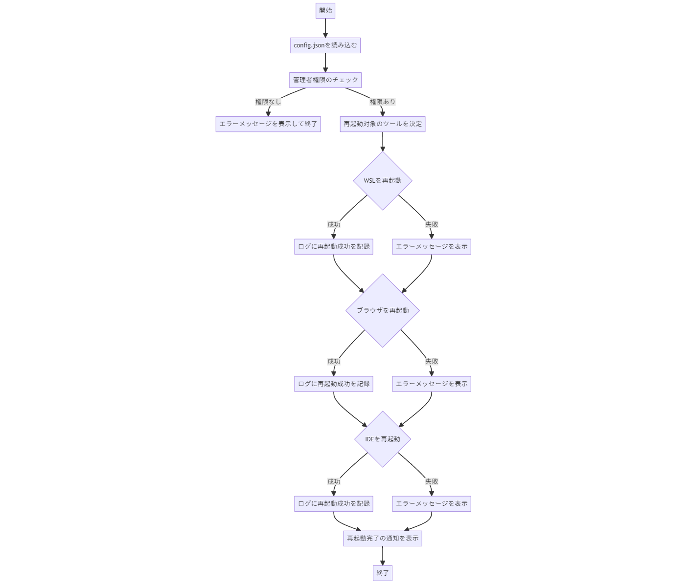

# DevEnvRebooter

## 概要
DevEnvRebooterは、開発環境（WSL、IDE、ブラウザ）の効率的な再起動を行うツールです。並列処理、GUIによる進行状況表示と通知、エラーハンドリングとログ記録、ログファイルのローテーション機能を備えています。

## 主な機能
- WSL、ブラウザ、IDEの並列再起動
- 設定ファイルによるカスタマイズ
- ログファイルのローテーション
- エラーハンドリングと通知機能

## 対象ユーザーと使用シーン
開発環境の再起動を頻繁に行う開発者向けのツールです。

## インストール手順
### 必要な環境
- PowerShell 5.1 以降

### インストール方法
1. リポジトリをクローンします。
    ```bash
    git clone https://github.com/yourusername/DevEnvRebooter.git
    cd DevEnvRebooter
    ```
2. 必要なモジュールをインストールします（必要な場合）。
    ```powershell
    Install-Module -Name Pester -Scope CurrentUser -Force
    ```

## 使用方法
### 基本的な使用方法
1. `main.ps1`をPowerShellで実行します。
    ```powershell
    powershell.exe -ExecutionPolicy Bypass -File "C:\Users\tn\Scripts\DevEnvRebooter\main.ps1"
    ```

### 設定ファイルの編集方法
`config.json`ファイルを編集して、再起動するアプリケーションのパスやその他の設定をカスタマイズします。

```json
{
    "RESTART_WAIT_TIME": 2,
    "BRAVE_PATH": "C:\\Program Files\\BraveSoftware\\Brave-Browser\\Application\\brave.exe",
    "CURSOR_PATH": "C:\\Users\\${USERNAME}\\AppData\\Local\\Programs\\cursor\\Cursor.exe",
    "LOG_FILE": "restart_log.txt",
    "HISTORY_FILE": "restart_history.log",
    "MAX_RETRIES": 3,
    "RETRY_WAIT_TIME": 5,
    "BROWSERS": ["C:\\Program Files (x86)\\Google\\Chrome\\Application\\chrome.exe", "C:\\Program Files (x86)\\Microsoft\\Edge\\Application\\msedge.exe"],
    "IDES": ["C:\\Users\\${USERNAME}\\AppData\\Local\\Programs\\cursor\\Cursor.exe", "C:\\Users\\${USERNAME}\\AppData\\Local\\Programs\\Microsoft VS Code\\Code.exe"],
    "LOG_MAX_SIZE_KB": 1024,
    "LOG_MAX_BACKUPS": 5,
    "LOG_LEVEL": "Info"
}
```

### 使用例
1. **基本的な使用例**
    ```powershell
    powershell.exe -ExecutionPolicy Bypass -File "C:\Users\tn\Scripts\DevEnvRebooter\main.ps1"
    ```

2. **設定ファイルのカスタマイズ**
    - `config.json`を編集し、使用するブラウザやIDEのパスを設定します。例えば、Chromeを再起動する場合は以下のように設定します。
    ```json
    {
        "BROWSERS": ["C:\\Program Files (x86)\\Google\\Chrome\\Application\\chrome.exe"],
        "IDES": ["C:\\Users\\${USERNAME}\\AppData\\Local\\Programs\\Microsoft VS Code\\Code.exe"]
    }
    ```

### 一般的なワークフロー
1. **設定ファイルの編集**
    - `config.json`を開き、再起動するツールのパスや設定をカスタマイズします。

2. **スクリプトの実行**
    - PowerShellを管理者として実行し、`main.ps1`を実行します。

3. **再起動プロセスの監視**
    - プログレスバーを確認し、再起動の進行状況を把握します。

4. **エラーメッセージの確認**
    - エラーが発生した場合、通知ポップアップやログファイルを確認し、問題を解決します。

### トラブルシューティング
- **エラー: 管理者権限が必要です**  
  スクリプトを管理者として実行してください。

- **エラー: 設定ファイルが無効です**  
  設定ファイルの形式やパスが正しいか確認してください。

### スクリーンショットと図
以下に、アプリケーションの動作を視覚的に理解するためのスクリーンショットと図を提供します。

### メイン画面

- **説明**: DevEnvRebooterのメイン画面。ここでWSL、ブラウザ、IDEの再起動が行われます。

### プログレスバー

- **説明**: 再起動プロセスの進行状況を示すプログレスバー。再起動が完了するまでの進行状況を視覚的に確認できます。

### エラーメッセージと通知

- **説明**: エラーメッセージが表示されたときのスクリーンショット。ユーザーがエラーの内容と対処方法を確認できます。

### 処理フロー図

- **説明**: アプリケーションの内部処理を示すフローチャート。各モジュール間の関係性とデータの流れが視覚的に理解できます。

## FAQ
1. **スクリプトを管理者として実行するには？**
    - PowerShellを右クリックし、「管理者として実行」を選択してください。

2. **ログファイルの場所は？**
    - デフォルトでは、スクリプトのディレクトリに`restart_log.txt`として保存されます。

3. **設定ファイルをカスタマイズするには？**
    - `config.json`を編集し、再起動するツールやログの設定を変更します。

## 貢献方法
1. リポジトリをフォークします。
2. 新しいブランチを作成します (`git checkout -b feature/your-feature`)。
3. 変更をコミットします (`git commit -am 'Add some feature'`)。
4. ブランチにプッシュします (`git push origin feature/your-feature`)。
5. プルリクエストを開きます。

## ライセンス情報
このプロジェクトはMITライセンスの下で公開されています。詳細については、`LICENSE`ファイルを参照してください。

## バージョン情報
### バージョン 1.0.0
- 初期リリース

## 更新履歴
### バージョン 1.0.0
- WSL、ブラウザ、IDEの再起動機能を実装
- ログファイルのローテーション機能を追加
- GUIによる進行状況表示と通知機能を実装
- 