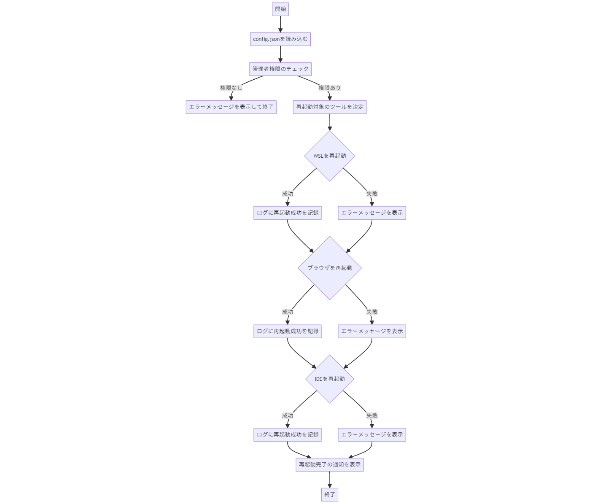

# User Guide for DevEnvRebooter

## 概要
DevEnvRebooterは、開発環境（WSL、IDE、ブラウザ）の効率的な再起動を行うツールです。並列処理、GUIによる進行状況表示と通知、エラーハンドリングとログ記録、ログファイルのローテーション機能を備えています。

## 詳細な使用方法
### 各機能の説明
- **WSL再起動**: WSLの停止と再起動を行います。
- **ブラウザ再起動**: 指定されたブラウザの再起動を行います。
- **IDE再起動**: 指定されたIDEの再起動を行います。

### 設定ファイルのカスタマイズ
`config.json`ファイルを編集して、再起動するアプリケーションのパスを設定します。

```json
{
    "RESTART_WAIT_TIME": 2,
    "BRAVE_PATH": "C:\\Program Files\\BraveSoftware\\Brave-Browser\\Application\\brave.exe",
    "CURSOR_PATH": "C:\\Users\\${USERNAME}\\AppData\\Local\\Programs\\cursor\\Cursor.exe",
    "LOG_FILE": "restart_log.txt",
    "HISTORY_FILE": "restart_history.log",
    "MAX_RETRIES": 3,
    "RETRY_WAIT_TIME": 5,
    "BROWSERS": ["C:\\Program Files (x86)\\Google\\Chrome\\Application\\chrome.exe", "C:\\Program Files (x86)\\Microsoft\\Edge\\Application\\msedge.exe"],
    "IDES": ["C:\\Users\\${USERNAME}\\AppData\\Local\\Programs\\cursor\\Cursor.exe", "C

:\\Users\\${USERNAME}\\AppData\\Local\\Programs\\Microsoft VS Code\\Code.exe"],
    "LOG_MAX_SIZE_KB": 1024,
    "LOG_MAX_BACKUPS": 5,
    "LOG_LEVEL": "Info"
}
```

### チュートリアル
1. **基本的な使用方法**
    ```powershell
    powershell.exe -ExecutionPolicy Bypass -File "C:\Scripts\DevEnvRebooter\main.ps1"
    ```

2. **高度な設定**
    - `config.json`を編集して、再起動するツールやログの設定をカスタマイズします。
    - 例: ブラウザやIDEのパスを変更する、ログの保存先を指定する、リトライ回数を設定するなど。

3. **エラーメッセージの解釈方法**
    - エラーメッセージが表示された場合、以下の手順で解決します。
        - **例**: "管理者権限が必要です"
            1. PowerShellを右クリックし、「管理者として実行」を選択します。
            2. スクリプトを再度実行します。
        - **例**: "設定ファイルが無効です"
            1. `config.json`の形式やパスを確認します。
            2. パスが正しいことを確認し、再度スクリプトを実行します。

### FAQ
1. **スクリプトを管理者として実行するには？**
    - PowerShellを右クリックし、「管理者として実行」を選択してください。

2. **ログファイルの場所は？**
    - デフォルトでは、スクリプトのディレクトリに`restart_log.txt`として保存されます。

3. **設定ファイルをカスタマイズするには？**
    - `config.json`を編集し、再起動するツールやログの設定を変更します。

4. **特定のツールだけを再起動するには？**
    - `config.json`で再起動するツールのリストを編集し、不要なツールのパスを削除します。

5. **ログのレベルを変更するには？**
    - `config.json`で`LOG_LEVEL`を`Info`、`Warning`、`Error`のいずれかに設定します。

## 高度な使用方法
### パフォーマンスチューニングのヒント
- 再起動待機時間（`RESTART_WAIT_TIME`）を短縮することで、再起動プロセスを高速化できます。
- ログレベル（`LOG_LEVEL`）を調整して、必要な情報のみをログに記録することで、ログファイルのサイズを管理します。

### コマンドラインオプション
- `-ExecutionPolicy Bypass`: スクリプト実行時にスクリプト実行ポリシーをバイパスします。
- `-File`: 実行するスクリプトファイルを指定します。

### ログファイルの読み方
- `restart_log.txt`には、スクリプト実行中の情報、警告、エラーメッセージが記録されます。
- `restart_history.log`には、スクリプトの実行履歴が記録されます。日付と時間、実行ユーザーが含まれます。

## スクリーンショットと図
以下に、アプリケーションの動作を視覚的に理解するためのスクリーンショットと図を提供します。

### メイン画面

- **説明**: DevEnvRebooterのメイン画面。ここでWSL、ブラウザ、IDEの再起動が行われます。

### プログレスバー

- **説明**: 再起動プロセスの進行状況を示すプログレスバー。再起動が完了するまでの進行状況を視覚的に確認できます。

### エラーメッセージと通知

- **説明**: エラーメッセージが表示されたときのスクリーンショット。ユーザーがエラーの内容と対処方法を確認できます。

### 処理フロー図

- **説明**: アプリケーションの内部処理を示すフローチャート。各モジュール間の関係性とデータの流れが視覚的に理解できます。

## 参考文献
- [PowerShell Documentation](https://docs.microsoft.com/en-us/powershell/)
- [Pester Documentation](https://pester.dev/docs/quick-start)


PowerShellスクリプトを管理者として実行するには、以下の手順に従います。

### 管理者としてPowerShellを実行する手順

1. **スタートメニューを開く**:
   - Windowsの「スタート」ボタンをクリックします。

2. **PowerShellを検索**:
   - 検索バーに「PowerShell」と入力します。

3. **管理者として実行**:
   - 「Windows PowerShell」が表示されたら、それを右クリックします。
   - メニューから「管理者として実行」を選択します。

4. **UAC (ユーザーアカウント制御)の確認**:
   - 「このアプリがデバイスに変更を加えることを許可しますか？」というメッセージが表示されたら、「はい」をクリックします。

5. **スクリプトを実行**:
   - 管理者権限で開いたPowerShellウィンドウで、スクリプトを実行します。

以下のコマンドを管理者権限のPowerShellウィンドウで実行してください：

```powershell
powershell.exe -ExecutionPolicy Bypass -File "C:\Users\tn\Scripts\DevEnvRebooter\main.ps1"
```

### 管理者としてPowerShellスクリプトを自動的に実行するショートカットを作成する方法

1. **デスクトップにショートカットを作成**:
   - デスクトップを右クリックし、「新規作成」→「ショートカット」を選択します。

2. **スクリプトへのパスを入力**:
   - 「項目の場所を入力してください」のフィールドに以下を入力し、「次へ」をクリックします：
     ```plaintext
     powershell.exe -ExecutionPolicy Bypass -File "C:\Users\tn\Scripts\DevEnvRebooter\main.ps1"
     ```

3. **ショートカットの名前を設定**:
   - ショートカットの名前を入力し、「完了」をクリックします。

4. **ショートカットを管理者として実行する設定**:
   - 作成したショートカットを右クリックし、「プロパティ」を選択します。
   - 「ショートカット」タブで「詳細設定」をクリックします。
   - 「管理者として実行」にチェックを入れて「OK」をクリックします。

これで、デスクトップのショートカットをダブルクリックすることで、管理者権限でスクリプトを実行することができます。

### スクリプトの修正案

スクリプト内で管理者権限をチェックし、管理者権限で再実行するようにすることもできます。以下に、その方法を示します：

#### main.ps1の修正

```powershell
# main.ps1
# This script manages restarting WSL, browsers, and IDEs.
# It needs to be run with administrator privileges.

# Function to restart script as admin if not already running as admin
function Restart-ScriptAsAdmin {
    $script = [System.Diagnostics.Process]::GetCurrentProcess().MainModule.FileName
    $arguments = "-NoProfile -ExecutionPolicy Bypass -File `"$($MyInvocation.MyCommand.Path)`""
    $startInfo = New-Object System.Diagnostics.ProcessStartInfo
    $startInfo.FileName = "powershell"
    $startInfo.Arguments = $arguments
    $startInfo.Verb = "runas"
    [System.Diagnostics.Process]::Start($startInfo) | Out-Null
    exit
}

# Check for administrator privileges
if (-not (Test-AdminPrivileges)) {
    Show-ErrorNotification "This script must be run with administrator privileges." "Admin Privileges Required"
    Restart-ScriptAsAdmin
    Exit 1
}

# Import required modules
Import-Module "$PSScriptRoot\modules\AdminCheck.psm1"
Import-Module "$PSScriptRoot\modules\WslFunctions.psm1"
Import-Module "$PSScriptRoot\modules\BrowserFunctions.psm1"
Import-Module "$PSScriptRoot\modules\IdeFunctions.psm1"
Import-Module "$PSScriptRoot\modules\Logging.psm1"
Import-Module "$PSScriptRoot\modules\Notification.psm1"

# Load global configuration file
$global:config = Get-Content "$PSScriptRoot\config.json" | ConvertFrom-Json

try {
    # Stop browsers
    foreach ($browser in $global:config.BROWSERS) {
        Restart-Browser -Path $browser
        Log-Info "$browser stopped."
    }

    # Restart WSL if needed
    if ($global:config.RESTART_WSL) {
        Restart-WSL
        Log-Info "WSL restarted successfully."
    }

    # Restart IDEs
    foreach ($ide in $global:config.IDES) {
        Restart-IDE -Path $ide -WslBased
        Log-Info "$ide restarted successfully."
    }

    # Start browsers
    foreach ($browser in $global:config.BROWSERS) {
        Start-Process -FilePath $browser
        Log-Info "$browser started."
    }

    # Show completion notification
    Show-Notification "Restart completed successfully." "Restart Complete"
} catch {
    # Log error and show notification
    Log-Error "An error occurred during the restart process." $_.Exception.Message
    Show-ErrorNotification "An error occurred during the restart process. Check the log for details." "Error"
}
```

これで、スクリプトが自動的に管理者権限で再実行されるようになります。